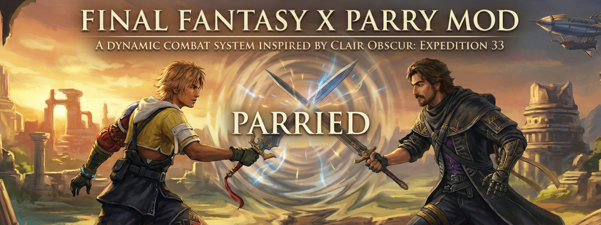

<p align="center">
  
</p>

# Fahrenheit Parry Mod

A standalone mod project for the Fahrenheit framework that adds a parry-focused gameplay module for **Final Fantasy X / X-2 HD Remaster**.

## Features

### Implemented

- [x] Standalone mod repository (not tied to in-tree Fahrenheit mod source layout)
- [x] Automated Fahrenheit dependency checkout/setup (`make setup` / `dotnet msbuild -t:Setup`)
- [x] Debug-first local build workflow (`make build`)
- [x] Full Fahrenheit build workflow (`make build-full` / `make build-release`)
- [x] Separate deploy workflows:
  - [x] Mod-only deploy (`make deploy-mod`)
  - [x] Full deploy (`make deploy`, `make deploy-clean`)
- [x] Local game path configuration with path probing + manual override (`make setup-game-dir`)
- [x] GitHub Actions CI/CD workflow for PR/push validation and tagged release packaging

### Planned / Possible Improvements

- [ ] Optional non-interactive first-run setup preset profile (for new contributors)
- [ ] Automated smoke tests once testable harnesses are available
- [ ] Checksums/signature metadata in release assets
- [ ] Optional changelog generation per tagged release

## End-User Installation (Release Assets)

Download assets from a tagged GitHub release.

### Option A: Full package (recommended for fresh installs)

Asset: `fahrenheit-full-<tag>.zip`

1. Open your game install directory (the folder containing `FFX.exe`).
2. Extract the ZIP so that a `fahrenheit/` folder is created in that game directory.
3. Launch using your normal Fahrenheit loader flow.

### Option B: Mod-only package (for existing Fahrenheit installs)

Asset: `fhparry-mod-<tag>.zip`

1. Ensure Fahrenheit is already installed in your game directory.
2. Extract the ZIP into `GAME_DIR/fahrenheit/mods/` so it creates/updates `GAME_DIR/fahrenheit/mods/fhparry`.
3. Ensure `GAME_DIR/fahrenheit/mods/loadorder` contains `fhparry` on its own line.

## Contributor Setup / Build / Deploy

### Prerequisites

#### Required to run setup/mod-build flow

- Windows
- Git
- .NET SDK `10.x`
- GNU Make (if using `make` commands)

#### Required for full native build (`make build-full` / `make build-release`)

- Visual Studio 2026 (or Build Tools) with workloads:
  - `.NET desktop development`
  - `Desktop development with C++`
- `vcpkg integrate install` from a Developer PowerShell prompt

### Quick Start

```bash
make install
make setup
make build
make deploy-mod
```

`make setup` will:

1. Run Fahrenheit setup/restore.
2. Offer game path configuration (`GAME_DIR`).
3. Offer an initial full build (recommended for first-time local environment setup).

### Common Commands

```bash
# Install/check full prerequisite set
make install

# Configure/save game path
make setup-game-dir GAME_DIR="C:\Path\To\Game"

# Mod-only debug build
make build

# Full debug build (stage loaders + managed projects)
make build-full

# Full release build (used for production/release assets)
make build-release

# Deploy full build without deleting extra files
make deploy

# Deploy full build as clean mirror (removes stale files)
make deploy-clean

# Deploy only this mod
make deploy-mod

# Convenience shortcuts
make build-and-deploy
make build-full-and-deploy
```

### Build Output Paths

- Debug output: `.workspace/fahrenheit/artifacts/deploy/dbg`
- Release output: `.workspace/fahrenheit/artifacts/deploy/rel`

### Configuration Variables

- `CONFIGURATION=Debug|Release` (default: `Debug`)
- `FAHRENHEIT_REPO=<git-url>`
- `FAHRENHEIT_DIR=<path>` (default: `.workspace/fahrenheit`)
- `NATIVE_MSBUILD_EXE=<path-to-MSBuild.exe>` (optional override)
- `GAME_DIR=<path-to-game-root-containing-FFX.exe>`
- `MOD_ID=<manifest-id>` (default: `fhparry`)
- `CI=true|false` (set `true` to disable interactive `make setup` prompts)
- `DRY_RUN=true|false` (preview prerequisite installs without changing system)

### Bootstrapping Without Make

On a fresh Windows install where `make` is not available yet:

```cmd
scripts\install-prerequisites.cmd full
```

Optional dry-run:

```cmd
scripts\install-prerequisites.cmd full --dry-run
```

## CI/CD

Workflow file: `.github/workflows/ci-cd.yml`

- Push/PR to `main`: runs verification (`tests if present` + `make build`)
- Tag push `v*`: runs `make build-release` and publishes:
  - `fahrenheit-full-<tag>.zip`
  - `fhparry-mod-<tag>.zip`

## License

This project is licensed under the MIT License. See [LICENSE](LICENSE).
